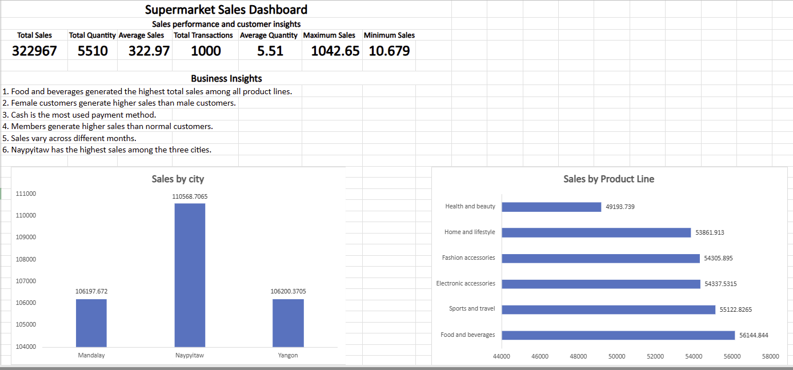
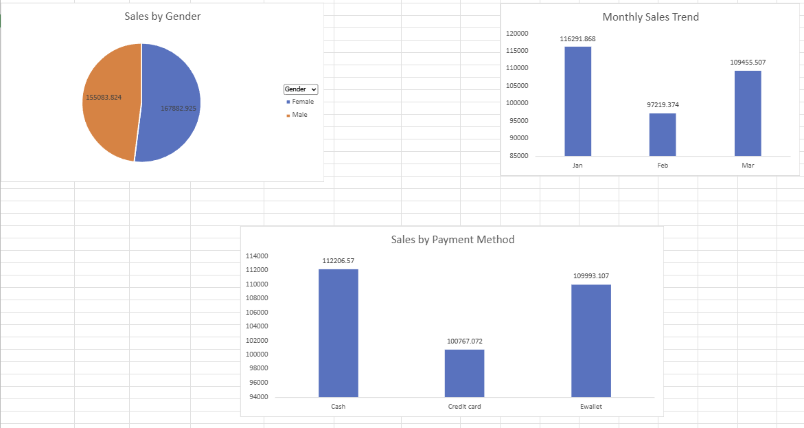

# 📊 Supermarket Sales Data Analysis

This project analyzes supermarket sales data to uncover insights into sales performance, customer behavior, and product trends.

### 🛠️ Tools Used
Microsoft Excel | PivotTables | PivotCharts | Interactive Dashboard

### 🔍 Key Insights
• Female customers generated higher sales.  
• Cash was the most frequently used payment method.  
• Member customers generated higher sales than Normal customers.  
• Food and Beverages was the top-performing product line.  

## Dashboard Preview

---

 **Maria Binte Malek**  
*Aspiring Data Analyst*

